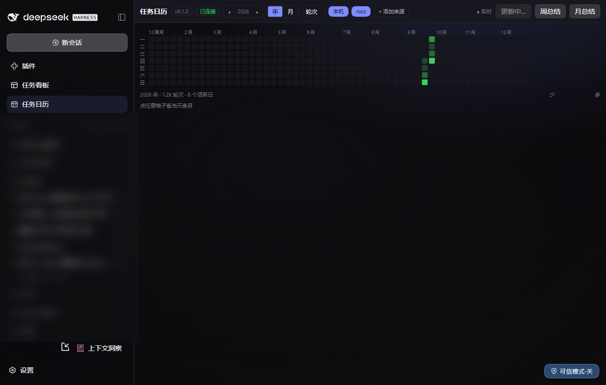
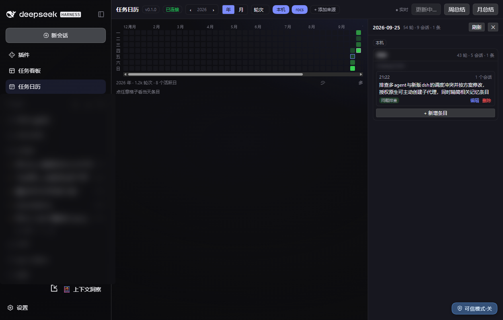
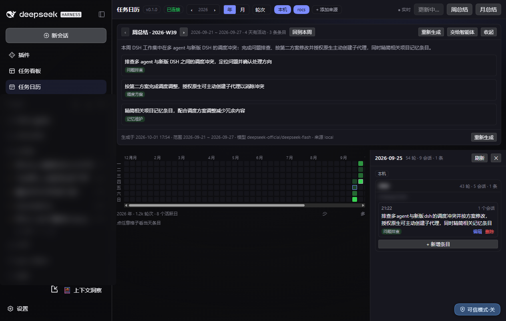

# dsh-LogWiki

**English** | [中文](./README.zh-CN.md)

> A **task calendar + Wiki for DSH (DeepSeek Harness)**. It distils what you did in DSH into one-line task cards per day, visualises workload as a heatmap, and generates big-picture weekly / monthly briefs.

[](./LICENSE)

-green)





> The plugin UI is in Chinese (a deliberate choice for its primary user). Screenshots show the real UI.

---

## The problem it solves

You spend a day working in DSH, but **the logs are stored per session** — to answer "what did I actually push forward last Wednesday?" you would have to dig through dozens of session files. dsh-LogWiki turns that into: **open the calendar → click the day → read a few cards**.

- **Zero extra bookkeeping.** Everything comes from the DSH session logs you already produce. You never write a daily report.
- **One sentence, not a transcript.** An LLM condenses each task into one plain sentence plus a keyword tag. You can edit it, and edited entries are **never overwritten** by later recomputation.
- **Weekly / monthly briefs stay big-picture.** The prompt explicitly asks for **8–12 items**; measured output was 11/10 (weekly) and 9/8 (monthly).

## Features

| Capability | Implementation |
|---|---|
| Calendar + workload heatmap | GitHub-style 53×7 grid; metric switchable between turns / tokens / sessions / entries; thresholds are quantiles (p25/p50/p75/p90) over the visible window |
| Click a day to see what happened | Drawer detail with three layers: **source → workspace → task entry** |
| One-line task cards | time + one-sentence summary + keyword tag + number of source sessions; sorted by time; card style |
| Editable tags | entries can be edited / deleted / added; edited ones get an `edited` badge and are **never overwritten**, and are excluded from LLM input |
| Manual refresh | a `更新` (Refresh) button with live SSE progress; incremental, batched, newest-first, resumable |
| Weekly / monthly briefs | summarised in-plugin via `ctx.llm` and **persisted**; only "regenerate" overwrites; a "hand to the agent" button writes the prompt into the composer |
| Period navigation | the brief **follows the day you are looking at** (click Sep 25 → you get that week), and `‹ ›` steps between periods **that actually have activity** |

**Source isolation** is structural: internal keys are `<source>::<session>`, entry ids include the source, and the first layer of the day detail is a source partition — so "local + remote server" showing up as separate partitions needed no schema change; phase 2 just wired up the collection path (see Roadmap).

## Install

**Zero build.** Clone and point at `lib/index.js` — no `npm install`, no bundling.

```powershell
git clone https://github.com/gychen-NJU/dsh-logwiki.git
```

Then append the following to `$DSH_HOME/profiles/web/cordis.patch.yml` (replace `<repo>` with your clone path):

```yaml
- insert:
    - id: logwiki
      name: 'file:///<repo>/dsh-logwiki/lib/index.js'
      config:
        scan:
          sinceDays: 365
          maxSessions: 2000
          maxNewPerRun: 300
        summarize:
          provider: deepseek-official
          model: deepseek-flash
          maxTokens: 8192
          timeoutMs: 60000
          maxConcurrency: 2
          onlyTopLevelSessions: true
        heatmap:
          metric: turns
          includeSubagents: true
        ui:
          language: zh
          weekStart: 1
        remote:
          enable: false
          sinceDays: 90
          maxBytesPerSync: 33554432
```

Restart that instance and a **任务日历** (Task Calendar) icon appears in the left sidebar. To uninstall, delete this block and restart.

**Notes**

- The plugin is loaded via an **absolute `file:///` path**, so it does not depend on the profile's `node_modules`.
- The client half is discovered through the **nearest ancestor `package.json`** (`dsh.client` + `exports["./client"]`) — so copy the whole `dsh-logwiki/`, not just `lib/`.
- **Changes to the host half require an instance restart**; client-half changes are hot-swapped by client-hmr.
- `config` is **replaced wholesale, not deep-merged** — always write the whole block when changing one value.

## Usage

1. Click **任务日历** in the left sidebar.
2. Use the year view for the heatmap; click any coloured cell to open that day.
3. Edit an entry's summary / tag and save — it is marked as hand-edited and later recomputation will not overwrite it.
4. Click **更新** (Refresh) to backfill new sessions incrementally. **The first backfill is heavy**: batched by `scan.maxNewPerRun`, newest first.
   - ⚠️ Reading a very large log (5 MB class, multi-frame zstd + replay validation) blocks the Node event loop for tens of seconds; **the page will feel sluggish during that window** — expected behaviour, not a crash.
5. **周总结 / 月总结** (weekly / monthly brief): follows the selected date; shows the cached brief if present, otherwise click "generate". "Hand to the agent" writes the prompt into the composer (with a copyable textarea as fallback).



## Configuration

| Key | Default | Description |
|---|---|---|
| `scan.sinceDays` | 365 | backfill window (days) |
| `scan.maxSessions` | 2000 | candidate session cap |
| `scan.maxNewPerRun` | 300 | how many **new** sessions one refresh processes (already-ingested ones are skipped cheaply) |
| `summarize.provider` / `model` | `deepseek-official` / `deepseek-flash` | model used for entries and briefs |
| `summarize.maxTokens` | 8192 | ⚠️ do not shrink this: at 2048 the brief output gets truncated and generation fails outright |
| `summarize.timeoutMs` | 60000 | per-call LLM timeout |
| `summarize.maxConcurrency` | 2 | concurrency cap |
| `summarize.onlyTopLevelSessions` | true | only top-level sessions produce entries (subagents are merged into their parent) |
| `heatmap.metric` | `turns` | default metric |
| `heatmap.includeSubagents` | true | whether subagent work counts towards the heatmap |
| `ui.language` / `weekStart` | `zh` / `1` | language / first day of week |
| `remote.enable` | false | master switch: when on, **Refresh** also syncs every enabled remote source (clicking "sync" on a single source is not gated by it) |
| `remote.maxFilesPerSync` | 400 | max files pulled per sync |
| `remote.maxBytesPerFile` | 67108864 | per-file cap (**measured after base64 encoding** — do not size it against the raw file) |
| `remote.maxBytesPerSync` | 33554432 | total byte budget per sync |
| `remote.commandTimeoutMs` | 120000 | timeout for a single remote command |
| `remote.maxSourcesPerRun` | 3 | how many sources one Refresh syncs |

## Where data lives

- Structured data goes through `ctx.storage` into **`$DSH_HOME/storages/dsh_logwiki.json`**: entries, briefs, sources, sync ledger, session fingerprints.
- **Do not hand-edit** that file — it is the plugin's only persistent store.
- ⚠️ The file is **shared by every instance with the same `$DSH_HOME`**. **Only one instance should have this plugin enabled at a time**, otherwise you get concurrent writes.

## Verification

```powershell
cd <repo>/dsh-logwiki

# Against a PRODUCTION instance: safe, read-only, idempotent
# (the sha256 of storages/dsh_logwiki.json is unchanged across a run — verified)
node scripts/accept-l1.mjs http://127.0.0.1:3080

# Full mode: writes data (edits an entry, regenerates a brief, triggers a backfill)
# — only against a dedicated test instance
node scripts/accept-l1.mjs http://127.0.0.1:3081 --mutate --refresh

# Offline self-checks (no running instance needed)
node scripts/verify-extract.mjs       # full replay of real logs + 159 assertions
node scripts/verify-prompts.mjs       # prompts / JSON tolerance / contract behaviour, 103 assertions
node scripts/verify-remote.mjs        # remote-source pure logic, 60 assertions
node scripts/verify-zstd-frames.mjs   # multi-frame zstd decoding, 8 assertions
```

Current result: **read-only 44/44 (exit 0)**; offline suites 159/0 · 103/0 · 60/60 · 8/8.

> `accept-l1.mjs` only hits HTTP endpoints and therefore **cannot tell whether a button actually does anything**. Click-driven interactions have their own list in section C2 of [`docs/MANUAL-CHECKLIST.md`](docs/MANUAL-CHECKLIST.md).

## Code layout

```
dsh-logwiki/
├─ package.json          dsh.client{platform:"web"} + exports["./client"]
├─ cordis.patch.yml      in-package patch (used when installing via dsh plugin add)
├─ lib/
│  ├─ index.js           integration: routes / refresh orchestration / SSE / entry CRUD / tool registration / dynamic-import degradation
│  ├─ extract.js         pure: events → session fingerprint (per-day by event time, tokens, tool histogram, top-level detection)
│  ├─ fold.js            pure: subagent rollup, day & workspace aggregation, quantile buckets, State/Day payloads
│  ├─ store.js           the only data file touching ctx: storage KV persistence (debounce + serialisation + degradation)
│  ├─ summarize.js       LLM layer: entry summaries + briefs (ctx.llm.stream; there is no complete())
│  ├─ prompts.js         Chinese prompts + tolerant JSON parsing
│  ├─ vendor-dsh.js      the **only** file importing @deepseek-ai/* (createRequire resolves the DSH install)
│  ├─ remote.js          pure: remote command building / index parsing / sync planning / decoding (never touches ctx)
│  ├─ remote-sources.js  pure: source validation + the "add source" prompt + the logwiki_import_source tool
│  ├─ vendor/            inlined fzstd (MIT, copied byte-for-byte — see its README)
│  └─ client.js          client half: hand-written ESM + React.createElement
└─ scripts/              acceptance and offline self-checks
```

Companion docs: [`docs/OVERVIEW.md`](docs/OVERVIEW.md) (**frozen interface contract** — change it before changing interfaces), [`docs/MANUAL-CHECKLIST.md`](docs/MANUAL-CHECKLIST.md) (acceptance list, measured results, known issues), [`DEVLOG.md`](DEVLOG.md) (per-milestone evidence and post-mortems).

## Hard constraints (read before changing code)

1. **The client half** must be `window.__ModuleLoader__.load({ id, factory })` with `id` exactly equal to the package name, or the page goes blank; it may **only `require('react')`** (the platform seeds 9 modules), everything else goes through `inject` + `ctx.get()`; styles must use `--dsw-*` tokens only.
2. **Cordis**: keep `inject` minimal (this plugin only hard-depends on `webServer`). `ctx.timeout()` needs `timer` injected and `ctx.logger` needs injecting too (otherwise it is **silent**). Yield the event loop with a plain `setTimeout`; log with `console`.
3. **Session data goes through `ctx.sessionQuery` only** — never parse log files by hand (multi-frame zstd + several format generations).
4. **Never append events to session logs** (v4 only accepts producer-owned source kinds). Plugin data always goes into `storage`.
5. **LLM**: `ctx.llm.stream` is the only verb; **omit `purpose` and `sessionId`**; a hand-rolled call gets a single attempt and reports failure as a finish chunk, so you must inspect it yourself.
6. **Rollup rule**: only non-top-level records are merged, **top-level records never participate**; merging must not rewrite `delegationDepth`. (Otherwise data disappears silently — 51 turns / 611 steps were lost this way once.)
7. **Multi-frame zstd**: DSH's `session.v4.jsonl.zstd` is **several independent frames concatenated**, and **Node's built-in `zlib.zstdDecompressSync` decodes only the first frame** (same 5.18 MB log: built-in → 1 line / 198 bytes; fzstd → 4333 lines / 15.5 MB). DSH's own multi-frame decoder lives in `@deepseek-ai/dsh-session-persistence-jsonl`, but that package's `exports` only exposes `.`, so `./zstd` is not importable — hence the inlined `fzstd`. **Local sessions still always go through `ctx.sessionQuery`**; manual decoding is only for remote sources.

## Roadmap

- [x] **Phase 1** (released and accepted): local sessions → calendar / heatmap / three-layer cards / entry editing / weekly & monthly briefs / period navigation
- [x] **Phase 2** (done, verified against a real remote host): remote sources
  - **Adding a source**: the toolbar's **+ 添加来源** dialog takes an SSH alias / WSL distro / remote `DSH_HOME`. Two registration paths — register directly when the info is complete, or click "hand to the agent" to generate a prompt that goes through **f2a-ssh** (WSL OpenSSH + ControlMaster, so 2FA happens once) and ends with the agent calling `logwiki_import_source`; when information is missing, **the prompt instructs the agent to ask you via `ask_user_question`**
  - **Fast-path sync**: click "sync" → `ctx.subprocess` runs `wsl.exe → ssh` (reusing the master connection, no 2FA) → remote `find` index → compare against the ledger and **pull only new/changed files** → `base64 -w0` back → decode locally with the inlined `fzstd` → reuse the very same `extract.js`
  - **Source-partitioned display**: the first layer of the day detail is the source partition (`本机` / `远程 <name>`), each with its own workspace cards and paths

### Known behaviours (not bugs)

- **A day can show turns but no task cards.** On some days the heatmap has colour yet the day detail is empty. The activity on those days comes entirely from **subagents whose parent session is recorded on a different day** — by the rollup contract subagents merge into their top-level parent and only top-level sessions produce entries, so the cards land on the parent's day. This is intended.
- **The first backfill is slow.** Reading very large session logs blocks the Node event loop for tens of seconds and the page feels sluggish; and `scan.maxNewPerRun` decides how many new sessions each refresh handles, so history fills in **batches**.

## License

[MIT](./LICENSE) © gychen-NJU

The inlined `fzstd` is MIT as well — see [`dsh-logwiki/lib/vendor/fzstd.LICENSE.txt`](dsh-logwiki/lib/vendor/fzstd.LICENSE.txt).
