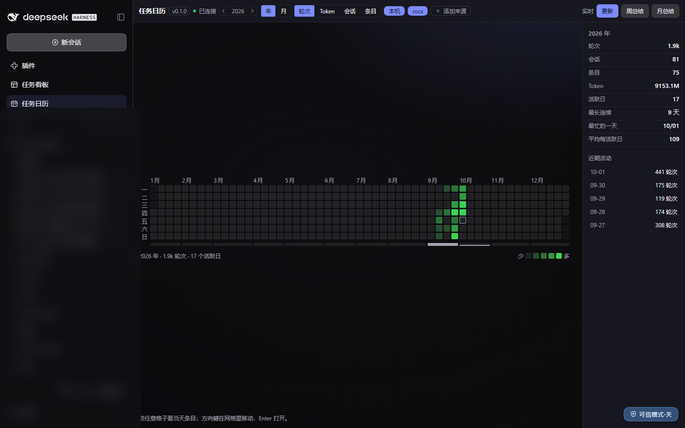
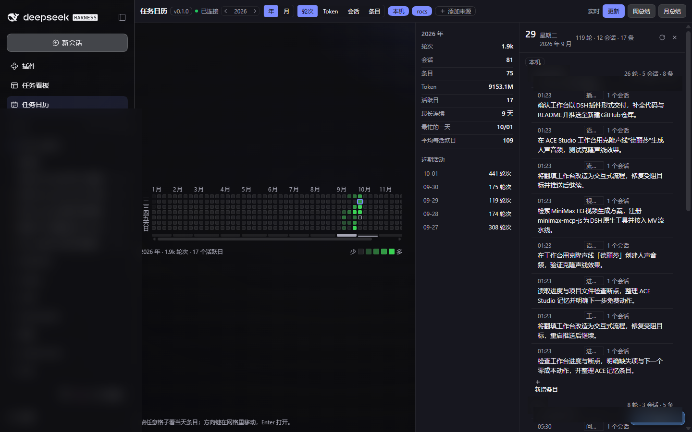
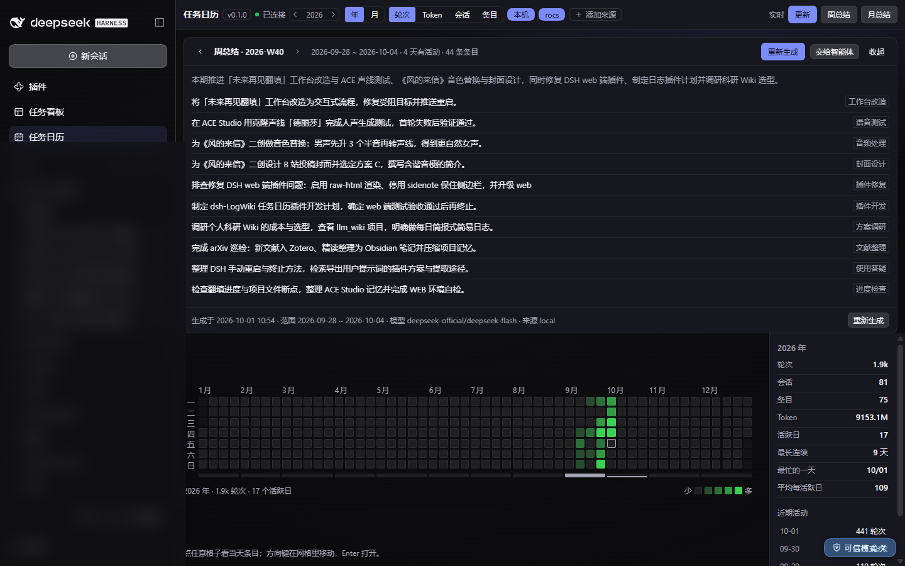
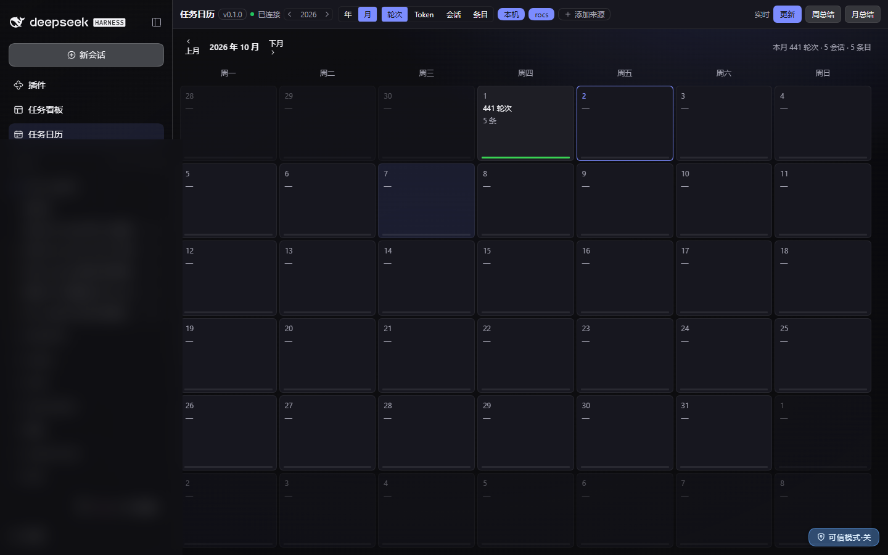
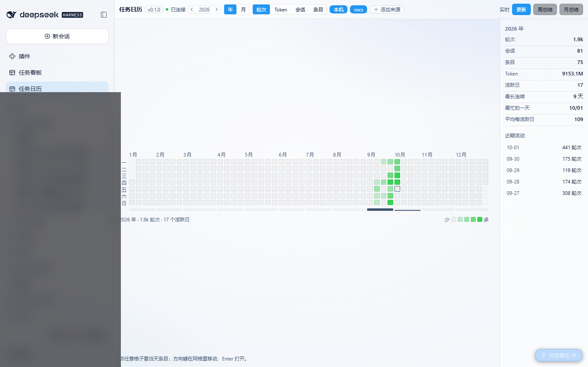
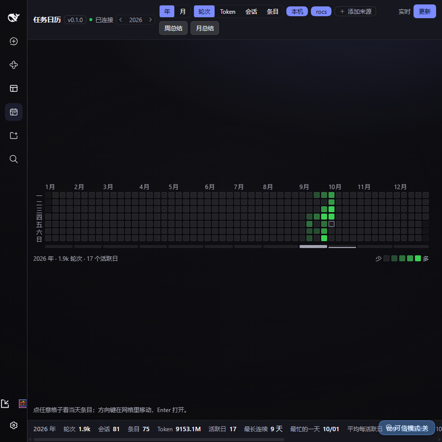

# dsh-LogWiki

[English](./README.md) | **中文**

> **DSH 的任务日历 + Wiki**：把你在 DSH 里的工作按天沉淀成"一句话任务卡"，用热力图看工作量，按周/月生成大方向简报。

[](./LICENSE)

-green)





> 插件界面为中文（面向主要使用者的有意选择）。截图为真实界面
> （左栏的工作区名与会话标题已打码，其余未作任何处理）。
>
> ⚠️ **主题说明**：上面两张是**深色**。拍摄所用的机器上装了一个第三方换肤插件
> （`dsh-dream-skin`「午夜黑」），它**强制深色**，DSH 内置的「外观 → 浅色」点了不生效，
> 因此**原生浅色主题在那台机器上无法验证**。下面那张浅色图是在把该皮肤切到「干净明亮」
> 后拍的，拍完已切回。完整口径见 [`docs/MANUAL-CHECKLIST.md`](docs/MANUAL-CHECKLIST.md) 的 C12 节。

---

## 它解决什么问题

你在 DSH 里干了一天的活，但**日志是按会话存的**——想知道"上周三我到底推进了哪几件事"，得翻几十个会话文件。dsh-LogWiki 把这件事变成：**打开日历 → 点那一天 → 看几张卡片**。

- **不新增任何记录负担**：数据全部来自你已经产生的 DSH 会话日志，你不需要写日报。
- **一句话而不是转录**：每条任务由 LLM 归纳成一句人话 + 一个关键词标签，你可以手改，改过的**永不被自动重算覆盖**。
- **周/月简报按"大方向"而非流水账**：明确要求模型产出 **8–12 条**，实测周 11/10 条、月 9/8 条。

## 功能

| 能力 | 实现 |
|---|---|
| 日历 + 工作量热力图 | GitHub 风格 53×7 网格，**格子边长按容器宽度算出来**（`clamp((容器宽 − 星期栏 − 3×52) / 53, 8, 22)px`），宽窗吃满、窄窗触底 8px 并改为横向滚动（不裁切）；指标可切 回合 / Token / 会话数 / 条目数；阈值按可见窗口的分位数（p25/p50/p75/p90）分档 |
| 年度台账栏 | 网格右侧 **216px 度量表**（轮次 / 会话 / 条目 / Token / 活跃日 / 最长连续 / 最忙的一天 / 平均每活跃日）+ 月份活动条 + 近期活动索引 —— 低对齐度的度量表，**刻意不做**大数字 hero 面板 |
| 点进某天看做了什么 | 抽屉式详情做成**行式台账**：来源 → 工作区 → 任务条目，层级靠缩进与发丝线表达，**不再是嵌套卡片** |
| 一句话任务条目 | 时间列 + 一句话总结 + 关键词标签 + 来源会话数；按时间升序 |
| 标签可编辑 | 条目可编辑/删除/新增；手改后打 `已手改` 徽章且**永不被重算覆盖**，同时被排除出 LLM 输入 |
| 手动更新 | 「更新」按钮 + SSE 实时进度；增量、分批、从新到旧，可断点续跑 |
| 周/月简报 | 插件内直调 LLM 归纳并**落库留存**；「重新生成」才覆盖；另有「交给智能体」按钮把提示词写进输入框 |
| 周期导航 | 简报**跟随你正在看的那一天**（点 9/25 就出 9/25 那一周），并可用 `‹ ›` 在**有活动的周期之间**前后跳 |
| 键盘与主题 | 热力图是真的 `role="grid"`：roving tabindex、方向键移动、Enter/Space 打开当天；颜色只用 `--dsw-*` token，有明确的对比度下限与 `prefers-reduced-motion` 开关 |

**来源隔离**：内部键是 `<来源>::<会话>`，条目 id 也含来源，日详情第一层就是来源分区 —— 所以「本机 + 远程服务器」各自成分区是数据结构原生支持的，二期把采集通道接通了（见文末 Roadmap）。

## 安装

**零构建**：克隆后直接指向 `lib/index.js` 即可，不需要 `npm install`、不需要打包。

```powershell
git clone https://github.com/gychen-NJU/dsh-logwiki.git
```

然后在 `$DSH_HOME/profiles/web/cordis.patch.yml` 末尾追加（把 `<repo>` 换成本机克隆路径）：

```yaml
- insert:
    - id: logwiki
      name: 'file:///<repo>/dsh-logwiki/lib/index.js'
      config:
        scan:
          sinceDays: 365
          maxSessions: 2000
          maxNewPerRun: 300
        summarize:
          provider: deepseek-official
          model: deepseek-flash
          maxTokens: 8192
          timeoutMs: 60000
          maxConcurrency: 2
          onlyTopLevelSessions: true
        heatmap:
          metric: turns
          includeSubagents: true
        ui:
          language: zh
          weekStart: 1
        remote:
          enable: false
          sinceDays: 90
          maxBytesPerSync: 33554432
```

重启该实例后，左栏出现「**任务日历**」。卸载 = 删掉这段再重启。

**要点**
- 插件用**绝对 `file:///` 路径**加载，因此不依赖 profile 的 `node_modules`。
- 客户端半边由**最近的祖先 `package.json`** 里的 `dsh.client` + `exports["./client"]` 发现 —— 所以别只拷 `lib/`，要连 `dsh-logwiki/package.json` 一起。
- **改 host 半边必须重启实例**；客户端半边改动由 client-hmr 热替换。
- `config` 是**整体替换、不深合并**，改任何一项都要把整块写全。

## 使用

1. 左栏点「**任务日历**」。
2. 年视图看热力图，点任意有色格进某天详情。
3. 改某条摘要/标签 → 保存（标记为手改，后续重算不覆盖）。
4. 点「**更新**」增量回填新会话。**首次回填很重**，按 `scan.maxNewPerRun` 分批、从新到旧。
   - ⚠️ 读超大日志（5 MB 级、多帧 zstd 解压 + 重放校验）会占住 Node 事件循环数十秒，**期间页面会发顿**——这是预期行为，不是崩溃。
5. 「**周总结**」/「**月总结**」：跟随选中日期；有缓存直接显示，没有就点「生成」。「交给智能体」会把提示词写进输入框（不支持时给可复制文本框）。









## 配置

| 键 | 默认 | 说明 |
|---|---|---|
| `scan.sinceDays` | 365 | 回填窗口（天） |
| `scan.maxSessions` | 2000 | 候选会话上限 |
| `scan.maxNewPerRun` | 300 | 每次「更新」最多处理多少个**新增**会话（已入库的会廉价跳过） |
| `summarize.provider` / `model` | `deepseek-official` / `deepseek-flash` | 摘要与简报所用模型 |
| `summarize.maxTokens` | 8192 | ⚠️ 别调太小：设成 2048 会把简报输出截断，生成直接失败 |
| `summarize.timeoutMs` | 60000 | 单次 LLM 调用超时 |
| `summarize.maxConcurrency` | 2 | 并发上限 |
| `summarize.onlyTopLevelSessions` | true | 只为顶层会话生成条目（子代理并入其父） |
| `heatmap.metric` | `turns` | 默认指标 |
| `heatmap.includeSubagents` | true | 子代理工作量是否计入热力图 |
| `ui.language` / `weekStart` | `zh` / `1` | 语言 / 周一起始 |
| `store.unit` | *（空 = 自动）* | 存储单元名。留空则**按实例自动派生** `dsh_logwiki_<profile>`（见[数据存放](#数据存放)）。只有要固定名字、或把老库挂到某实例上时才需要显式填。 |
| `remote.enable` | false | 远程来源总开关：开了之后「更新」会顺带同步所有已启用的远程来源（单独点「同步」不受它限制） |
| `remote.maxFilesPerSync` | 400 | 单次同步最多拉多少个文件 |
| `remote.maxBytesPerFile` | 67108864 | 单文件上限（按 base64 **编码后**的体积算，别按原始大小设小） |
| `remote.maxBytesPerSync` | 33554432 | 单次同步总字节预算 |
| `remote.commandTimeoutMs` | 120000 | 单条远端命令超时 |
| `remote.maxSourcesPerRun` | 3 | 一次「更新」最多同步几个来源 |

## 数据存放

- 结构化数据经 `ctx.storage` 落到 **`$DSH_HOME/storages/<unit>.json`**：条目、简报、来源、同步账本、会话指纹。
- **单元名是「一实例一个」的**。默认 `store.unit` 留空时，插件按当前 profile 派生 `dsh_logwiki_<profile>` —— `dsh_logwiki_web`、`dsh_logwiki_desktop`…… 完全拿不到 profile 信息时，退回历史的 `dsh_logwiki`。
- **为什么必须分开。** 同一个 `$DSH_HOME` 上跑两个实例是常态（桌面端 + 一个 `dsh web`，或两个 `dsh web` profile）。共用一个单元是不安全的：落盘是**整份文档重写**，两个进程各自持有一份内存快照，**后写的那个会把先写的整份抹掉**（典型的 lost update）。一实例一单元从根上消除这类故障——不需要加锁、不需要合并、也不需要谁记得"只能开一个"。
- **单元名必须匹配 `^[a-z][a-z0-9_]*$`**（DSH 自己的约束），所以**不能用点号和连字符**。这就是分隔符用 `_`（`dsh_logwiki_web`）而不是 `.` 的原因——`dsh_logwiki.web` 会被直接拒绝。
- **不要手改**这个文件——它是插件唯一的持久化载体，文件头里的 `unit.name` 在打开时会被校验。
- **怎么确认当前用的是哪个单元？** `GET /api/dsh-logwiki/ping`（以及 `/health`）里的 `store.unit` 会如实回报。别猜。

### 迁移老数据

旧版本一直用不带后缀的 `dsh_logwiki` 单元，所以升级后每个实例都会从空库开始，直到你把老库复制过去。用自带脚本：

```powershell
node scripts/migrate-unit.mjs dsh_logwiki_web       # 老库 → web 实例
node scripts/migrate-unit.mjs dsh_logwiki_desktop   # 老库 → 桌面端实例
```

- 脚本会**连文件头一起改写**。只改文件名是**不行**的：存储层打开时会校验 `unit.name`，不一致直接抛 `missing or foreign unit header`。
- **源文件永不被改动**；目标已存在时默认不覆盖（要覆盖得显式加 `--force`）；`--dry-run` 只报告不写。每个实例跑一次，然后重启该实例。
- 退出码非 0 表示什么都没写。

## 验证

```powershell
cd <repo>/dsh-logwiki

# 对**生产实例**：安全、只读、幂等
# （跑前后该实例的 storages/<unit>.json 的 sha256 不变，已实证）
node scripts/accept-l1.mjs http://127.0.0.1:3080

# 完整模式：会写数据（改条目、重生成简报、触发回填）——仅限专用测试实例
node scripts/accept-l1.mjs http://127.0.0.1:3081 --mutate --refresh

# 纯离线自检（不需要运行中的实例）
node scripts/verify-extract.mjs       # 真实日志全量重放 + 159 断言
node scripts/verify-prompts.mjs       # 提示词 / JSON 容错 / 契约行为 103 断言
node scripts/verify-remote.mjs        # 远程来源逻辑、工具 schema、路径派生、按实例分库、隐私门
node scripts/verify-zstd-frames.mjs   # 多重 zstd frame 解码 8 断言

# 把老库迁到按实例分立的单元上
node scripts/migrate-unit.mjs dsh_logwiki_web --dry-run
```

当前结果：**只读 45/45（exit=0）**（2026-10-02，UI 精修验证实例，unit `dsh_logwiki_uicheck`）；离线四套件 159/0 · 103/0 · 70/70 · 8/8。

> `accept-l1.mjs` 的断言条数是**随套件一起长出来的**，所以 [`docs/MANUAL-CHECKLIST.md`](docs/MANUAL-CHECKLIST.md)
> 的历史记录里会出现 29 / 33 / 36 / 44 —— 那是**不同日期 / 不同实例 / 不同套件版本**的结果，不是自相矛盾。
> 该文件现在带一张按日期的结果表；**当前口径是 45/45**。

> `accept-l1.mjs` 只打 HTTP 端点，**测不到"按钮点了有没有反应"**。点击类交互另见 [`docs/MANUAL-CHECKLIST.md`](docs/MANUAL-CHECKLIST.md) 的 **`C-CLICK`** 节清单。

## 代码结构

```
dsh-logwiki/
├─ package.json          dsh.client{platform:"web"} + exports["./client"]
├─ cordis.patch.yml      包内 patch（用 dsh plugin add 安装时用）
├─ lib/
│  ├─ index.js           集成层：路由 / 刷新编排 / SSE / 条目 CRUD / 工具注册 / 动态 import 降级
│  ├─ paths.js           唯一派生本机路径的地方（$DSH_HOME、profile 目录、npm 前缀）——绝不写死用户名
│  ├─ extract.js         纯函数：事件 → 会话指纹（按事件时间归日、token、工具直方图、顶层判定）
│  ├─ fold.js            纯函数：子代理归并、天/工作区聚合、分位分档、State/Day payload
│  ├─ store.js           唯一接触 ctx 的数据文件：storage KV 落盘（防抖 + 串行化 + 降级）
│  ├─ summarize.js       LLM 层：条目摘要 + 简报（ctx.llm.stream，无 complete）
│  ├─ prompts.js         中文提示词 + JSON 容错解析
│  ├─ vendor-dsh.js      **唯一** import @deepseek-ai/* 的文件（createRequire 解析 DSH 安装路径）
│  ├─ remote.js          纯函数：远程来源的命令构造 / 清单解析 / 同步规划 / 解码（不接触 ctx）
│  ├─ remote-sources.js  纯函数：来源定义校验 + 「添加来源」提示词 + logwiki_import_source 工具
│  ├─ vendor/            内联 fzstd（MIT，逐字节复制，见其 README）
│  └─ client.js          客户端半边：手写 ESM + React.createElement
└─ scripts/              验收与离线自检（accept-l1、verify-*、migrate-unit）
```

配套文档：[`docs/OVERVIEW.md`](docs/OVERVIEW.md)（**冻结接口契约**，改接口先改它）、[`docs/MANUAL-CHECKLIST.md`](docs/MANUAL-CHECKLIST.md)（验收清单、实测结果、已知问题）、[`DEVLOG.md`](DEVLOG.md)（逐里程碑证据与踩坑记录）。

## 关键技术约束（改代码前必读）

1. **客户端半边**必须是 `window.__ModuleLoader__.load({ id, factory })`，`id` 逐字等于包名，否则整页白屏；**只能 `require('react')`**（平台只 seed 9 个模块），其它服务走 `inject` + `ctx.get()`；样式只用 `--dsw-*` token。
2. **Cordis**：`inject` 保持最小（本插件只硬依赖 `webServer`）。`ctx.timeout()` 需要 `timer` 注入、`ctx.logger` 同样需注入（否则**静默**）。让出事件循环用普通 `setTimeout`，日志用 `console`。
3. **会话数据只走 `ctx.sessionQuery`**，绝不手工解析日志（多重 zstd 帧 + 多代格式）。
4. **绝不向会话日志追加事件**（v4 只接受 producer-owned source kind）。插件数据一律进 `storage`。
5. **LLM**：`ctx.llm.stream` 是唯一动词，**省略 `purpose` 与 `sessionId`**；手搓调用只有一次 attempt，失败以 finish chunk 返回，必须自己判。
6. **归并规则**：只归并非顶层记录，**顶层永不参与归并**；归并不得改写 `delegationDepth`。（否则会静默丢数据——曾实测丢 51 回合 / 611 steps。）
7. **多帧 zstd**：DSH 的 `session.v4.jsonl.zstd` 是**多个独立 frame 拼接**，而 **Node 自带的 `zlib.zstdDecompressSync` 只解第一帧**（实测同一份 5.18 MB 日志：内置解出 1 行 / 198 字节，fzstd 解出 4333 行 / 15.5 MB）。DSH 自己的多帧解码器在 `@deepseek-ai/dsh-session-persistence-jsonl`，但该包 `exports` 只暴露 `.`，`./zstd` 不可 import —— 所以内联了 `fzstd`。**本地会话仍一律走 `ctx.sessionQuery`**，手工解码只用于远程来源。

## Roadmap

- [x] **一期**（已发布并已通过验收）：本机会话 → 日历 / 热力图 / 三层卡片 / 条目编辑 / 周月简报 / 周期导航
- [x] **二期**（已完成并已实测跑通真实远端）：远程来源
  - **添加来源**：工具栏「+ 添加来源」对话框收 SSH 别名 / WSL 发行版 / 远端 `DSH_HOME`；两条登记路径 —— 信息齐了直接登记，或点「交给智能体」生成提示词走 **f2a-ssh**（WSL OpenSSH + ControlMaster，2FA 只发生一次）→ 由智能体调 `logwiki_import_source` 落库；信息不全时**提示词会要求智能体用 `ask_user_question` 向你索取**
  - **快速通道同步**：点「同步」→ `ctx.subprocess` 调 `wsl.exe → ssh`（复用主连接免 2FA）→ 远端 `find` 清单 → 比对账本**只拉新增/变化** → `base64 -w0` 回传 → 本地用内联 `fzstd` 解码 → 复用同一个 `extract.js`
  - **来源隔离展示**：日详情第一层就是来源分区（`本机` / `远程 <名称>`），各自带独立的工作区卡片与路径

### 已知行为（不是 bug）

- **有回合数、但那天没有任务卡**：在个别日子里，热力图有颜色、日详情却是空的。原因是那天的活动全部来自**父会话记在另一天的子代理**——按归并契约，子代理并入其顶层父会话、条目只由顶层会话生成，所以落在父会话那一天。属预期行为。
- **首次回填很慢**：读超大会话日志会占住 Node 事件循环数十秒，期间页面会发顿；且 `scan.maxNewPerRun` 决定每轮处理多少个新增会话，历史是**分批**补齐的。

## License

[MIT](./LICENSE) © gychen-NJU

内联的 `fzstd` 亦为 MIT，见 [`dsh-logwiki/lib/vendor/fzstd.LICENSE.txt`](dsh-logwiki/lib/vendor/fzstd.LICENSE.txt)。
